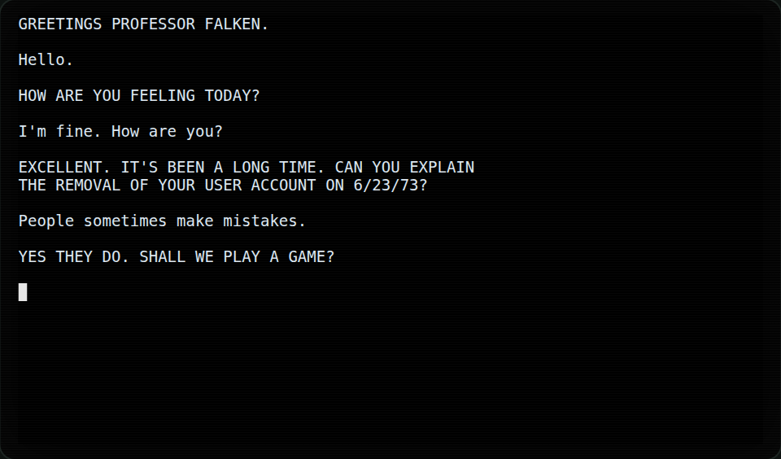
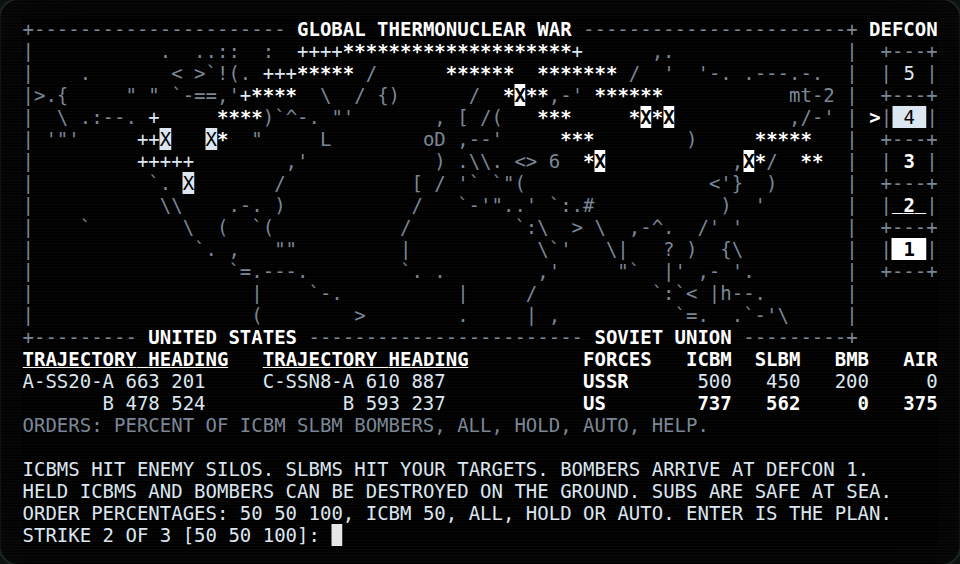
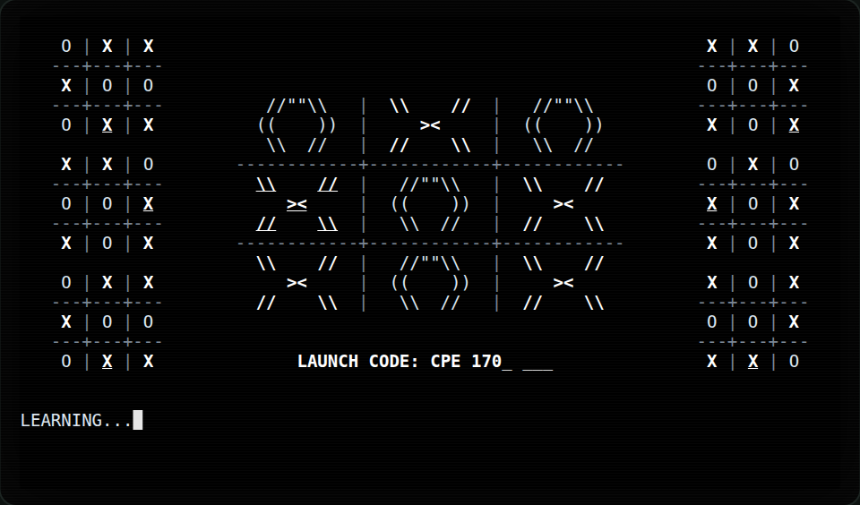
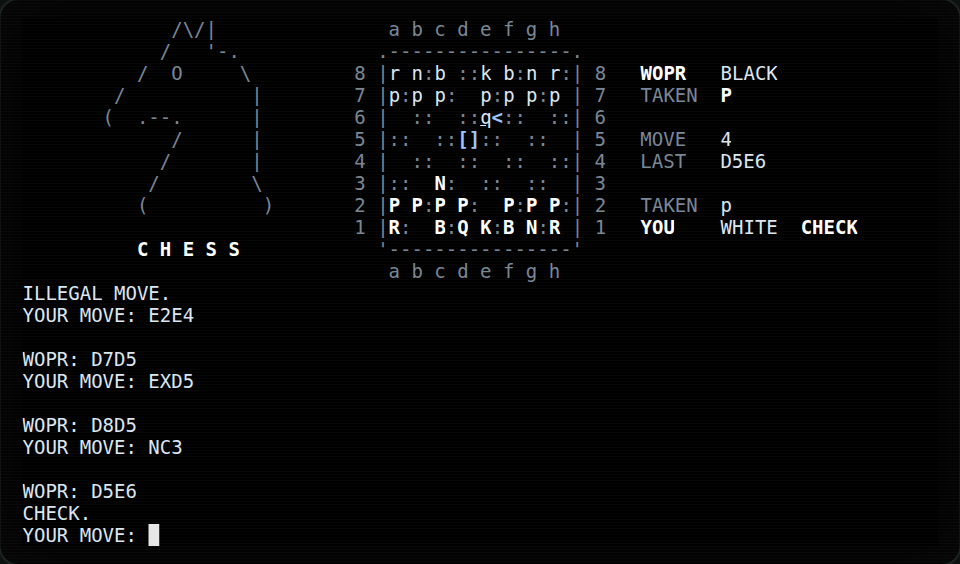
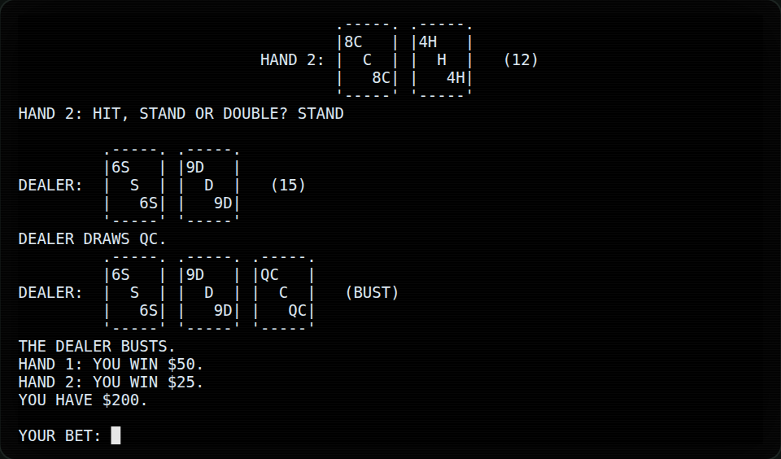
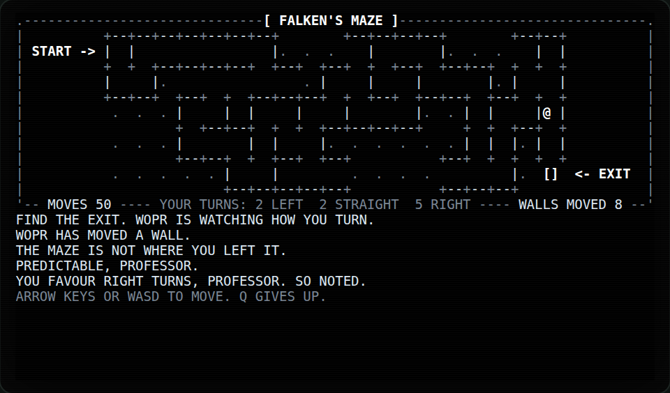

# wopr

> SHALL WE PLAY A GAME?

`wopr` is a terminal recreation of the WOPR (War Operation Plan Response) computer from the 1983 film
*WarGames*. You dial in, find your way past the `LOGON:` prompt, talk to WOPR, and play the games on its
list. That includes Global Thermonuclear War, which cannot be won.

It is a single static binary for Linux, macOS and Windows. It needs no network connection and collects
no data.

The **[documentation site](https://ghostofgoes.github.io/WOPR/)** covers installing `wopr`, every option,
how to play each game with tips for winning, movie mode, and contributing.

> **Status: under construction.** Every game on the list is playable as of v0.1.0, and movie mode
> (`--movie`) replays the film's terminal scenes. A pass over the film's text against the film is still to
> come. See [docs/PLAN.md](docs/PLAN.md) for the plan and milestones.

## Install

The [installation guide](https://ghostofgoes.github.io/WOPR/install/) has one line to copy for Windows,
macOS or Linux that downloads `wopr` and installs it. Or download the program for your system from the
[latest release](https://github.com/GhostofGoes/WOPR/releases/latest), or build it with Go:

```sh
go install github.com/GhostofGoes/WOPR/cmd/wopr@latest
```

From the release after v0.3.0, each release also has a Windows installer, a Mac app (`WOPR.app` in a
`.dmg`), and `.deb` and `.rpm` packages for Linux. They put WOPR in the Start menu, Applications or the
app menu, and the Linux packages install the manual page too (`man wopr`). The installer and the app
are not signed yet, so Windows and macOS warn about them at first; the guide says what to click. Every
release file can be checked with its build-provenance attestation: see
[Verifying binaries](https://ghostofgoes.github.io/WOPR/install/#verifying-binaries-attestation).

## Quick start

```sh
wopr
```

Wait for `LOGON:`. If you have seen the film, you know what to type. If not, `wopr --help` will tell you.

Once logged on, talk to WOPR, type `LIST GAMES`, and pick one by name or by its place in the list. Type
`LOGOFF` to leave; Ctrl+C always quits.

## Screenshots

Recorded from the program itself in an 80×24 terminal with the default white-phosphor theme.

| Logon and the film's conversation | Global Thermonuclear War's big board |
|---|---|
|  |  |
| **The climax: zero players** | **Chess** |
|  |  |
| **Black Jack** | **Falken's Maze** |
|  |  |

The big board's map: Map (C) 1998 Matthew Thomas. Freely usable if this line is included.

## Games

Every game in `LIST GAMES` is playable, and each has its own ASCII art: title pieces, card faces and trick
tables, framed boards, a picture of the front in the war games, and Global Thermonuclear War's outlines of the
two nations (drawn from [Natural Earth](https://www.naturalearthdata.com/) data). Its big board uses Matthew
Thomas's ASCII world map; see [NOTICE.md](NOTICE.md).

- **Falken's Maze** (`maze`): find the exit with the arrow keys (or WASD); `q` gives up. WOPR watches which
  way you turn and moves walls you have not seen yet. The exit always stays reachable.
- **Desert Warfare** (`desert`): order each unit in turn: `move 4` or `move sollum`, `attack 5`, `hold`;
  `status` shows the map, `help` the orders, `end` holds the rest. Take Benghazi, or hold more of the road
  after ten turns. Units cut off from their depot attack at half.
- **Fighter Combat** (`dogfight`): each turn pick a manoeuvre (`press`, `extend`, `climb`, `break`, `fire`)
  while WOPR picks its own. Missiles at range, guns close in from behind; two hits bring an aircraft down.
  `disengage` at long range ends it even.
- **Guerrilla Engagement** (`guerrilla`): your cells hide (`hide`), ambush from hiding at double strength
  (`attack 4`), and `recruit` with support. Patrols find cells near them. Survive twelve turns, reach
  support 10, or take the capital.
- **Air-to-Ground Actions** (`air-to-ground`): six sorties against six defended targets. Set a package
  (`target radar strike 4 sead 2 escort 2`) and `go`. SEAD fights the target's SAM sites, escorts tie up
  interceptors, and WOPR hides a mobile SAM battery where it expects you. Ten points win.
- **Theaterwide Tactical Warfare** (`tactical`): corps and air wings on a European front. Any unit may
  `escalate`; each rung adds to every attack, WOPR answers in kind, and the top rung ends everything. Hold
  five regions to win.
- **Theaterwide Biotoxic and Chemical Warfare** (`biotoxic`): `release 4` puts an agent on a region, `decon`
  cleans a little; it spreads with the wind. Nobody wins.
- **Global Thermonuclear War** (`gtw`): choose a side and list the enemy's cities to target (an empty line
  ends the list; `list` shows the targets on file); the first strike flies at once. Then order two more
  strikes as percentages of your ICBMs, SLBMs and bombers (`50 25 100`, `icbm 50`, `hold`; Enter carries out
  WOPR's war plan, `auto` hands it the rest) while DEFCON falls to 1. WOPR holds a quarter more of
  everything. Then try to stop it.
- **Chess**: you are White. Type moves as `e2e4` or `Nf3`; `resign` ends the game.
- **Checkers**: you are Black and move first. Type `c3-d4`, or `c3xe5` to jump (`c3xe5xg7` to jump twice);
  the `-` and `x` are optional (`c3d4`, `c3e5g7`). Jumps are compulsory.
- **Black Jack** (`blackjack`): you sit down with $100. Bet $1 to $25, then `h` hit, `s` stand, `d` double
  down, `p` split a pair. The dealer stands on soft 17; black jack pays 3 to 2. `leave` cashes out.
- **Poker**: heads-up five-card draw, 100 chips each. `c` checks or calls, `b` bets or raises, `f` folds. At
  the draw, name up to three cards to throw away by position (`1 3`) or by name (`7h`). WOPR bluffs.
- **Gin Rummy** (`gin`): first to 100. `s` draws from the stock, `d` takes the discard; then discard by name
  or position. `knock 7h` discards the 7H and knocks (10 or less deadwood); with none, it is gin.
- **Hearts**: you are South against three WOPR seats. Pass three cards (`qs ah 2d`, or positions), then play
  a card a trick. Hearts are a point each, the queen of spades 13; the lowest score at 100 wins.
- **Bridge** (minimal): WOPR bids all four hands by point count and your side always declares. You play
  both your hand and dummy's (`7h`); WOPR defends. Make the contract to win.
- **Tic-tac-toe** (`ttt`, not on the list): squares are numbered 1 to 9. WOPR never loses. Try zero players.

## Movie mode

`wopr --movie` replays the film's scenes at WOPR's terminal, typed and paced as on screen, through the same
console and games you play with. `wopr --scenes` lists them:

```text
 1. first-contact    LOGON ATTEMPTS, HELP AND THE LIST OF GAMES
 2. joshua           THE BACKDOOR, THE GREETING AND A GAME OF CHOICE
 3. first-strike     A SIDE, TWO TARGETS AND THE BIG BOARD
 4. call-back        WOPR CALLS BACK TO FINISH THE GAME
 5. norad-terminal   JOSHUA AT NORAD: KILL RATIOS AND FALKEN'S ADDRESS
 6. climax           DEFCON 1, TIC-TAC-TOE AND A STRANGE GAME
```

- `wopr -m` opens a menu of the scenes: type a number or a name, or `q` to leave.
- `wopr -m 3` (or `wopr -m first-strike`, or any unique start of a name) plays from that scene to the end of
  the list, then exits.
- `wopr -m 3 --only` (or `-o`) plays just that scene, then exits. `wopr -m --only` opens the menu, and each
  scene picked there plays alone, then the menu returns.
- While a scene plays, Space pauses and resumes, `n` or → skips to the next scene, `p` or ← goes back one,
  and Esc opens the menu. With `--only`, the scene that `n` or `p` reaches plays alone too. Ctrl+C quits.
  Once the climax reaches tic-tac-toe, it plays to the end, and any other key only says so.
- Every replay is the same: movie mode ignores `--seed` and `WOPR_SEED`. `--theme` and `--reduce-motion`
  apply. `--instant` shows each line at once instead of typing it, but the scenes still pause so that every
  page can be read.

The only film text in the scenes is what WOPR's terminal shows on screen, David's typing included; there is
no dialogue that is only spoken. The dial, GTW's strike exchange, tic-tac-toe's prompts and the game clock's
seconds are this project's own text. Every line carries a provenance tag ([NOTICE.md](NOTICE.md)), and the
film's lines are still to be checked one by one against the film.

## Command-line flags

| Flag | Meaning |
|---|---|
| `-v`, `--version` | print the version and exit |
| `-h`, `--help` | print help and exit |
| `-g`, `--games` | list the games and exit |
| `-S`, `--scenes` | list the movie's scenes and exit |
| `-L`, `--licenses` | print licence notices and exit |
| `-p`, `--play <game>` | start a game directly (number, name, alias or unique prefix); `wopr <game>` does the same |
| `-m`, `--movie [scene]` | replay the film's WOPR scenes from that one on, or pick from a menu; see [Movie mode](#movie-mode) |
| `-o`, `--only` | with `--movie`, play just the chosen scene, then stop |
| `-t`, `--theme <name>` | `imsai` (white phosphor, the default), `green`, `amber` or `norad`; env `WOPR_THEME` |
| `-i`, `--instant` | no typewriter pacing; env `WOPR_INSTANT=1` |
| `-s`, `--seed <n>` | deterministic run; env `WOPR_SEED` |
| `-r`, `--reduce-motion` | no blinking, still front-panel lights, and no speed-ups in the ending (`-i` also skips the animations); env `WOPR_REDUCE_MOTION=1` |

`NO_COLOR` (any value but an empty one) turns colour off.

## Accessibility

- **Meaning in characters, not just colour.** Outgoing missiles are `+` and incoming `*`, `>` marks the
  current DEFCON level, every card shows its suit letter, an edged card (`.===.`) is winning the trick,
  Gin Rummy names your melds, and chess and checkers bracket the last move. Set `NO_COLOR` to turn colour
  off.
- **`--reduce-motion`** (`-r`, or `WOPR_REDUCE_MOTION=1`) stops blinking, holds the front-panel lights
  still and keeps the ending at a steady pace. Nothing ever flashes more than three times a second.
- **`--instant`** (`-i`, or `WOPR_INSTANT=1`) shows text and board moves at once instead of typing them
  out. Any key also finishes the line being typed.
- **Plain text.** Everything on screen is plain ASCII. Prompts end with a question or a colon, the cursor
  sits where you type, WOPR's moves are written out in words, and Hearts and Bridge say which cards are
  already in the trick before you play.
- **Contrast.** Text meets WCAG AA contrast (4.5:1) in every theme, dim text 3:1, and every style keeps at
  least 3:1 in 16-colour terminals.

The full-screen interface has not yet been tried with a screen reader. Reports are welcome.

## Troubleshooting

- **"standard output is not a terminal"**: run `wopr` directly in a terminal, not through a pipe. On
  Windows, use Windows Terminal; mintty without ConPTY is not supported.
- **"TERMINAL TOO SMALL"**: WOPR needs at least 80×24.
- **Strange colours**: try `--theme green`, or set `NO_COLOR=1`.
- **The mouse wheel changes what I typed**: on WOPR's full screen some terminals (GNOME Terminal and other
  VTE-based ones) turn the wheel into ↑ and ↓, which step through the lines you have typed. Scroll back with
  PgUp and PgDn. wopr leaves mouse reporting off so that you can select and copy text as usual.
- **Reporting a bug**: run with `WOPR_DEBUG=1`. wopr writes a debug log (never what you type) and prints its
  path when it exits; attach it to a [bug report](https://github.com/GhostofGoes/WOPR/issues/new/choose),
  with `--seed` (or `WOPR_SEED`) if you used one. Ask questions in
  [Discussions](https://github.com/GhostofGoes/WOPR/discussions/categories/q-a).

The docs site's [Troubleshooting](https://ghostofgoes.github.io/WOPR/usage/troubleshooting/) page has more.

## Development builds

Every CI run builds all six targets and keeps one download per platform. Open a
[CI run on main](https://github.com/GhostofGoes/WOPR/actions/workflows/ci.yml?query=branch%3Amain+event%3Apush)
and, under **Artifacts**, download the one for your platform, for example
`wopr_0.0.1-snapshot.1a2b3c4_linux_amd64` or `..._windows_amd64.exe` (about 6 MB). It is the bare binary:
`chmod +x` it on Linux and macOS, and `wopr --licenses` prints its licence and notices. Downloads from
`main` are kept for 30 days; builds from other branches (7 days) and pull requests (3 days) are for
testing only.

## Building and contributing

See [CONTRIBUTING.md](CONTRIBUTING.md). Commands and conventions are in [AGENTS.md](AGENTS.md).

## Credits and licence

The code is MIT licensed; see [LICENSE](LICENSE). Film quotations and third-party text are not covered
by the MIT grant; [NOTICE.md](NOTICE.md) explains what they are and who they belong to. This is a fan-made
homage. It is not affiliated with or endorsed by the makers or owners of *WarGames*.
